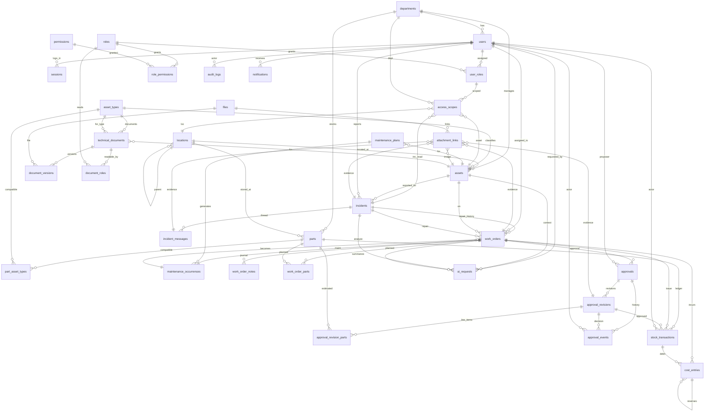

# Database Schema — EquipCare AI (Doc04 v1.2, 33 bảng)

> Nguồn duy nhất: **Document04_CSDL_ERD_v1_2_Clean.docx** (LOCKED baseline 2026-09-10).
> Áp dụng cho: PostgreSQL 17 · Prisma 5.x · NestJS 10.x · baseline P1.
> File này dùng làm đặc tả triển khai (`apps/api/prisma/schema.prisma`) — mọi cột, FK, CHECK, UNIQUE đều phải khớp.

---

## 0. Quy ước chung (Doc04 §3.1)

- Tên bảng & cột: `snake_case` tiếng Anh.
- Mỗi bảng có `id uuid PRIMARY KEY`.
- Cột chung `A` (audit-only): `id`, `created_at timestamptz NOT NULL DEFAULT now()`.
- Cột chung `M` (mutable): `A` + `updated_at timestamptz NOT NULL DEFAULT now()` + `row_version integer NOT NULL DEFAULT 1`.
- Mốc thời gian nghiệp vụ: `timestamptz`; ngày bảo trì: `date`.
- Múi giờ hiển thị: `Asia/Ho_Chi_Minh`.
- Tiền: `numeric(18,2)`; số lượng: `numeric(18,3)`.
- FK mặc định: `ON DELETE RESTRICT`. Khóa chính không đổi sau khi tạo.
- Danh mục ngừng dùng: `is_active boolean` (mặc định `true`).
- Thiết bị: `manual_state` (Doc04 §5.4).
- Dữ liệu đã phát sinh nghiệp vụ **không xóa vật lý**.
- Ngưỡng/thời hạn/giới hạn tệp đọc từ `system_settings` (key-value JSONB), không hard-code.

---

## 1. Ánh xạ trạng thái nghiệp vụ (Doc04 §3.2)

| Đối tượng | Mã kỹ thuật (enum) | Nhãn nghiệp vụ |
|---|---|---|
| **incidents.status** | `NEW`, `AWAITING_INFO`, `IN_PROGRESS`, `RESOLVED`, `CLOSED`, `CANCELLED` | Mới tạo; Chờ bổ sung; Đang xử lý; Đã giải quyết; Đã đóng; Hủy |
| **work_orders.status** | `NEW`, `ASSIGNED`, `IN_PROGRESS`, `WAITING_APPROVAL`, `COMPLETED`, `CANCELLED` | Mới tạo; Đã phân công; Đang thực hiện; Chờ phê duyệt; Hoàn thành; Hủy |
| **approvals.status** | `DRAFT`, `PENDING`, `NEEDS_INFO`, `APPROVED`, `REJECTED`, `CANCELLED` | Nháp; Chờ duyệt; Yêu cầu bổ sung; Đã phê duyệt; Từ chối; Hủy |
| **assets.manual_state** | `NORMAL`, `SUSPENDED`, `RETIRED` | Đang hoạt động; Tạm ngừng; Ngừng sử dụng |
| **assets.activity_status (view `v_asset_state`)** | `OPERATIONAL`, `MAINTENANCE`, `REPAIR`, `SUSPENDED`, `RETIRED` | Đang hoạt động; Đang bảo trì; Đang sửa chữa; Tạm ngừng; Ngừng sử dụng |
| **approval_events.event_type** | `SUBMIT`, `REQUEST_INFO`, `APPROVE`, `REJECT`, `CANCEL` | — |
| **stock_transactions.movement_type** | `RECEIPT`, `ISSUE`, `ADJUST_IN`, `ADJUST_OUT` | — |
| **files.storage_state** | `STAGED`, `READY`, `REJECTED` | — |
| **ai_requests.status** | `QUEUED`, `RUNNING`, `SUCCEEDED`, `FAILED`, `TIMED_OUT` | — |
| **audit_logs.actor_type** | `USER`, `SYSTEM` | — |

> "Quá hạn" (`is_overdue`) là giá trị dẫn xuất (Doc04 §7.2), **không** thuộc enum `work_orders.status`.
> `work_orders.status` không có `PAUSED`/`WAITING_PARTS` — pause lưu qua `work_order_notes.note_type`.

---

## 2. Nhóm A — Tổ chức, tài khoản, phạm vi dữ liệu (7 bảng)

### 2.1. `departments` — Phòng ban

| Cột | Kiểu | NULL | Ghi chú |
|---|---|---|---|
| `id` | uuid | Không | PK |
| `code` | varchar(30) | Không | UNIQUE |
| `name` | varchar(150) | Không | |
| `is_active` | boolean | Không | mặc định `true` |
| `created_at`, `updated_at`, `row_version` | (M) | | |

**Ràng buộc**:
- UNIQUE `(code)`
- FK: không
- Ngừng hiệu lực chỉ sau khi đã xử lý thiết bị/scope đang tham chiếu.

### 2.2. `locations` — Khu vực / vị trí

| Cột | Kiểu | NULL | Ghi chú |
|---|---|---|---|
| `id` | uuid | Không | PK |
| `code` | varchar(40) | Không | UNIQUE |
| `name` | varchar(150) | Không | |
| `parent_id` | uuid | Có | FK `locations.id` (cha-con); NULL = nút gốc |
| `is_active` | boolean | Không | mặc định `true` |
| `created_at`, `updated_at`, `row_version` | (M) | | |

**Ràng buộc**:
- UNIQUE `(code)`
- FK `parent_id → locations.id`
- CHECK: `parent_id <> id`; chu trình cây bị cấm (CHECK + app-level validation)
- Quan hệ cha-con **không** tự cấp quyền (Q-07 cấu hình scope riêng).

### 2.3. `users` — Tài khoản nội bộ

| Cột | Kiểu | NULL | Ghi chú |
|---|---|---|---|
| `id` | uuid | Không | PK |
| `login_name` | varchar(100) | Không | UNIQUE, không phân biệt hoa/thường |
| `full_name` | varchar(150) | Không | |
| `email` | varchar(254) | Có | |
| `department_id` | uuid | Có | FK `departments.id` (đơn vị công tác; không phải quyền dữ liệu) |
| `password_hash` | text | Không | Băm an toàn (Argon2id) — không lưu mật khẩu rõ |
| `is_locked` | boolean | Không | mặc định `false` |
| `must_change_password` | boolean | Không | mặc định `false` |
| `auth_version` | integer | Không | mặc định `1`; tăng khi cần vô hiệu hóa phiên |
| `created_at`, `updated_at`, `row_version` | (M) | | |

**Ràng buộc**:
- UNIQUE `(login_name)` — case-insensitive (collation `C` hoặc `lower(login_name)`)
- FK `department_id → departments.id`
- Không hỗ trợ đăng ký công khai (Doc02 FR-AUTH).
- Khóa tài khoản không xóa lịch sử.

### 2.4. `roles` — Vai trò cố định

| Cột | Kiểu | NULL | Ghi chú |
|---|---|---|---|
| `id` | uuid | Không | PK |
| `code` | varchar(30) | Không | UNIQUE; một trong `ADMIN`, `MANAGER`, `TECHNICIAN`, `USER` |
| `name` | varchar(100) | Không | Tên hiển thị tiếng Việt |
| `created_at`, `updated_at`, `row_version` | (M) | | |

**Ràng buộc**:
- UNIQUE `(code)`
- 4 vai trò seed cứng khi bootstrap (Doc04 §2 TK-06).
- P1 **không** cho phép tùy biến ma trận quyền từ giao diện (Doc04 §2 TK-06).

### 2.5. `user_roles` — Gán vai trò cho tài khoản

| Cột | Kiểu | NULL | Ghi chú |
|---|---|---|---|
| `id` | uuid | Không | PK |
| `user_id` | uuid | Không | FK `users.id` |
| `role_id` | uuid | Không | FK `roles.id` |
| `is_active` | boolean | Không | mặc định `true` |
| `granted_by` | uuid | Có | FK `users.id`; NULL **chỉ** khi bootstrap Admin đầu tiên |
| `revoked_at` | timestamptz | Có | NULL = còn hiệu lực |
| `created_at`, `updated_at`, `row_version` | (M) | | |

**Ràng buộc**:
- UNIQUE `(user_id, role_id)`
- FK: `user_id`, `role_id`, `granted_by`
- `granted_by IS NULL` chỉ hợp lệ cho bản ghi gán vai trò đầu tiên khi bootstrap (Doc04 §5.3). Sau đó, mọi gán/thu hồi đều phải có `granted_by` khác NULL.
- Thu hồi vai trò (`revoked_at`) không xóa lịch sử; mọi thay đổi ghi `audit_logs` với `actor_type='USER'` hoặc `='SYSTEM'` (bootstrap).

### 2.6. `access_scopes` — Phạm vi dữ liệu cho từng `user_roles`

| Cột | Kiểu | NULL | Ghi chú |
|---|---|---|---|
| `id` | uuid | Không | PK |
| `user_role_id` | uuid | Không | FK `user_roles.id` |
| `scope_type` | varchar(20) | Không | một trong `GLOBAL`, `DEPARTMENT`, `LOCATION`, `ASSET`, `INCIDENT_READ` |
| `department_id` | uuid | Có | FK `departments.id` |
| `location_id` | uuid | Có | FK `locations.id` |
| `asset_id` | uuid | Có | FK `assets.id` |
| `incident_id` | uuid | Có | FK `incidents.id` |
| `is_active` | boolean | Không | mặc định `true` |
| `granted_by` | uuid | Không | FK `users.id` |
| `created_at`, `updated_at`, `row_version` | (M) | | |

**Ràng buộc**:
- FK: `user_role_id`, `department_id`, `location_id`, `asset_id`, `incident_id`, `granted_by`
- CHECK đúng **một** khóa mục tiêu khớp `scope_type`:
  - `scope_type='GLOBAL'` → cả 4 FK mục tiêu phải NULL
  - `scope_type='DEPARTMENT'` → `department_id` NOT NULL, các FK khác NULL
  - `scope_type='LOCATION'` → `location_id` NOT NULL (Q-07: bao gồm con còn `is_active=true`)
  - `scope_type='ASSET'` → `asset_id` NOT NULL
  - `scope_type='INCIDENT_READ'` → `incident_id` NOT NULL (chỉ cấp đọc sự cố)
- Quyền hành động + scope phải thuộc cùng `user_role_id` (Doc05 §8.2 + Doc04 DB-12).
- Thiếu bản ghi phạm vi **không** được hiểu là có quyền toàn cục (Doc04 §5.3).

### 2.7. `sessions` — Phiên đăng nhập

| Cột | Kiểu | NULL | Ghi chú |
|---|---|---|---|
| `id` | uuid | Không | PK |
| `user_id` | uuid | Không | FK `users.id` |
| `token_hash` | text | Không | Băm refresh token; không lưu giá trị gốc |
| `expires_at` | timestamptz | Không | |
| `revoked_at` | timestamptz | Có | NULL = còn hiệu lực |
| `auth_version` | integer | Không | Khớp `users.auth_version` lúc tạo |
| `created_at` | (A) | | |

**Ràng buộc**:
- UNIQUE `(token_hash)`
- FK `user_id → users.id`
- Phiên hợp lệ khi: chưa hết hạn, chưa thu hồi, `auth_version` khớp `users.auth_version` hiện tại (Doc04 §5.3).

---

## 3. Nhóm B — Thiết bị, sự cố, công việc, bảo trì (8 bảng)

### 3.1. `asset_types` — Loại thiết bị

| Cột | Kiểu | NULL | Ghi chú |
|---|---|---|---|
| `id` | uuid | Không | PK |
| `code` | varchar(40) | Không | UNIQUE |
| `name` | varchar(150) | Không | |
| `description` | text | Có | |
| `is_active` | boolean | Không | mặc định `true` |
| `created_at`, `updated_at`, `row_version` | (M) | | |

### 3.2. `assets` — Hồ sơ thiết bị

| Cột | Kiểu | NULL | Ghi chú |
|---|---|---|---|
| `id` | uuid | Không | PK |
| `code` | varchar(50) | Không | UNIQUE, không tái sử dụng |
| `name` | varchar(200) | Không | |
| `asset_type_id` | uuid | Không | FK `asset_types.id` |
| `department_id` | uuid | Không | FK `departments.id` (đơn vị quản lý) |
| `location_id` | uuid | Không | FK `locations.id` (vị trí hiện tại) |
| `serial_number` | varchar(100) | Có | |
| `supplier_name` | varchar(200) | Có | P1 chưa cần danh mục NCC riêng |
| `purchased_on` | date | Có | |
| `commissioned_on` | date | Có | Ngày đưa vào sử dụng |
| `warranty_until` | date | Có | |
| `specifications` | jsonb | Không | Thông số linh hoạt |
| `qr_key` | uuid | Không | UNIQUE; định danh QR ổn định |
| `manual_state` | varchar(20) | Không | enum `NORMAL/SUSPENDED/RETIRED`; mặc định `NORMAL` |
| `state_reason` | text | Có | Lý do SUSPENDED/RETIRED |
| `created_by` | uuid | Không | FK `users.id` |
| `created_at`, `updated_at`, `row_version` | (M) | | |

**Ràng buộc**:
- UNIQUE `(code)`, `(qr_key)`
- FK: `asset_type_id`, `department_id`, `location_id`, `created_by`
- UNIQUE `(id, asset_type_id)` hỗ trợ FK ghép (Doc04 §6.2)
- CHECK `manual_state IN ('NORMAL','SUSPENDED','RETIRED')`
- View `v_asset_state` tính `activity_status` từ `manual_state` + WO đang hoạt động (Doc04 §7.2)
- Tệp/hình ảnh qua `attachment_links`
- RETIRED không phát sinh WO mới theo luồng thông thường (Doc02 FR-ASSET-07)

### 3.3. `maintenance_plans` — Kế hoạch bảo trì

| Cột | Kiểu | NULL | Ghi chú |
|---|---|---|---|
| `id` | uuid | Không | PK |
| `asset_id` | uuid | Không | FK `assets.id` (đúng một thiết bị) |
| `name` | varchar(200) | Không | |
| `interval_unit` | varchar(10) | Không | `DAY` hoặc `MONTH` |
| `interval_value` | integer | Không | > 0 |
| `start_on` | date | Không | Mốc bắt đầu |
| `schedule_basis` | varchar(24) | Không | `FIXED` (P1) hoặc `AFTER_COMPLETION` (deferred) |
| `next_due_on` | date | Có | Ngày đến hạn kế tiếp |
| `checklist` | jsonb | Không | `{code, content, required}[]` |
| `is_active` | boolean | Không | true=ACTIVE, false=PAUSED |
| `created_by` | uuid | Không | FK `users.id` |
| `created_at`, `updated_at`, `row_version` | (M) | | |

**Ràng buộc**:
- FK: `asset_id`, `created_by`
- UNIQUE `(id, asset_id)` cho FK ghép (Doc04 §6.2)
- Một thiết bị có thể nhiều plan (nội dung/chu kỳ khác nhau)
- Cập nhật plan **không** làm thay đổi WO đã sinh (Doc04 §5.4)

### 3.4. `maintenance_occurrences` — Kỳ bảo trì

| Cột | Kiểu | NULL | Ghi chú |
|---|---|---|---|
| `id` | uuid | Không | PK |
| `plan_id` | uuid | Không | FK `maintenance_plans.id` |
| `asset_id` | uuid | Không | FK `assets.id` (snapshot tại thời điểm sinh kỳ) |
| `due_on` | date | Không | |
| `status` | varchar(20) | Không | enum runtime: `SCHEDULED/DUE/OVERDUE/SKIPPED/COMPLETED/CANCELLED` |
| `plan_version` | integer | Không | `maintenance_plans.row_version` tại thời điểm sinh kỳ |
| `plan_snapshot` | jsonb | Không | Chu kỳ + nội dung kiểm tra snapshot |
| `created_at` | (A) | | |

**Ràng buộc**:
- FK: `plan_id`, `asset_id`
- FK ghép `(plan_id, asset_id) → (maintenance_plans.id, .asset_id)` (Doc04 §6.2)
- UNIQUE `(plan_id, due_on)` (Doc04 DB-04)
- Mỗi kỳ có tối đa 1 WO (`work_orders.occurrence_id` UNIQUE partial)

### 3.5. `incidents` — Sự cố

| Cột | Kiểu | NULL | Ghi chú |
|---|---|---|---|
| `id` | uuid | Không | PK |
| `code` | varchar(50) | Không | UNIQUE |
| `asset_id` | uuid | Không | FK `assets.id` |
| `reporter_id` | uuid | Không | FK `users.id` |
| `description` | text | Không | Mô tả ban đầu |
| `impact_description` | text | Không | Mức độ ảnh hưởng theo người báo |
| `occurred_at` | timestamptz | Có | Thời điểm phát hiện |
| `priority_code` | varchar(20) | Có | Mức ưu tiên do Manager xác nhận |
| `confirmed_category` | varchar(100) | Có | Nhóm lỗi đã xác nhận |
| `status` | varchar(24) | Không | enum Doc04 §3.2 |
| `resolved_at` | timestamptz | Có | |
| `closed_at` | timestamptz | Có | |
| `closed_by` | uuid | Có | FK `users.id` |
| `cancelled_at` | timestamptz | Có | |
| `cancelled_by` | uuid | Có | FK `users.id` |
| `cancel_reason` | text | Có | Bắt buộc khi hủy |
| `created_at`, `updated_at`, `row_version` | (M) | | |

**Ràng buộc**:
- UNIQUE `(code)`
- FK: `asset_id`, `reporter_id`, `closed_by`, `cancelled_by`
- UNIQUE `(id, asset_id)` cho FK ghép với `work_orders` (Doc04 §6.2)
- CHECK `status IN ('NEW','AWAITING_INFO','IN_PROGRESS','RESOLVED','CLOSED','CANCELLED')`
- CHECK: `(closed_at IS NULL) = (closed_by IS NULL)`, tương tự cho cancelled
- `cancel_reason NOT NULL` khi `status='CANCELLED'`

### 3.6. `incident_messages` — Yêu cầu bổ sung / phản hồi sự cố

| Cột | Kiểu | NULL | Ghi chú |
|---|---|---|---|
| `id` | uuid | Không | PK |
| `incident_id` | uuid | Không | FK `incidents.id` |
| `author_id` | uuid | Không | FK `users.id` |
| `message_type` | varchar(20) | Không | `REQUEST_INFO` hoặc `SUPPLEMENT` |
| `body` | text | Không | |
| `created_at` | (A) | | |

**Ràng buộc**:
- FK: `incident_id`, `author_id`
- CHECK `message_type IN ('REQUEST_INFO','SUPPLEMENT')`
- Manager tạo `REQUEST_INFO`; người báo tạo `SUPPLEMENT`
- Bổ sung theo thời gian; tệp kèm theo qua `attachment_links`

### 3.7. `work_orders` — Phiếu công việc

| Cột | Kiểu | NULL | Ghi chú |
|---|---|---|---|
| `id` | uuid | Không | PK |
| `code` | varchar(50) | Không | UNIQUE |
| `asset_id` | uuid | Không | FK `assets.id` |
| `kind` | varchar(20) | Không | `REPAIR` hoặc `MAINTENANCE` |
| `incident_id` | uuid | Có | FK `incidents.id` (chỉ khi REPAIR) |
| `occurrence_id` | uuid | Có | FK `maintenance_occurrences.id` (chỉ khi MAINTENANCE) |
| `assignee_id` | uuid | Có | FK `users.id` (trống khi NEW) |
| `created_by` | uuid | Có | FK `users.id`; NULL nếu scheduler tạo |
| `creation_mode` | varchar(20) | Không | `MANUAL` hoặc `SCHEDULED` |
| `description` | text | Không | |
| `priority_code` | varchar(20) | Không | |
| `due_at` | timestamptz | Không | |
| `status` | varchar(24) | Không | enum Doc04 §3.2 |
| `started_at` | timestamptz | Có | |
| `completed_at` | timestamptz | Có | |
| `confirmed_cause` | text | Có | |
| `action_taken` | text | Có | |
| `result_summary` | text | Có | |
| `checklist_snapshot` | jsonb | Không | mặc định `[]` cho REPAIR |
| `checklist_results` | jsonb | Không | mặc định `[]` |
| `downtime_start` | timestamptz | Có | |
| `downtime_end` | timestamptz | Có | |
| `department_id_snapshot` | uuid | Không | FK `departments.id` (snapshot tại tạo, Q-05) |
| `cancelled_at` | timestamptz | Có | |
| `cancelled_by` | uuid | Có | FK `users.id` |
| `cancel_reason` | text | Có | |
| `created_at`, `updated_at`, `row_version` | (M) | | |

**Ràng buộc**:
- UNIQUE `(code)`, `(occurrence_id)` partial (`WHERE occurrence_id IS NOT NULL`) (Doc04 DB-04)
- FK: `asset_id`, `incident_id`, `occurrence_id`, `assignee_id`, `created_by`, `cancelled_by`, `department_id_snapshot`
- FK ghép (Doc04 §6.2):
  - `(incident_id, asset_id) → (incidents.id, .asset_id)`
  - `(occurrence_id, asset_id) → (maintenance_occurrences.id, .asset_id)`
- CHECK `kind='REPAIR' XOR kind='MAINTENANCE'` + tương ứng FK NOT NULL (Doc04 DB-01):
  ```sql
  CHECK (
    (kind='REPAIR' AND incident_id IS NOT NULL AND occurrence_id IS NULL) OR
    (kind='MAINTENANCE' AND occurrence_id IS NOT NULL AND incident_id IS NULL)
  )
  ```
- CHECK `status IN ('NEW','ASSIGNED','IN_PROGRESS','WAITING_APPROVAL','COMPLETED','CANCELLED')`
- Partial UNIQUE INDEX trên `(incident_id)` cho các status hoạt động (Doc04 DB-03):
  ```sql
  CREATE UNIQUE INDEX uq_wo_active_incident ON work_orders (incident_id)
    WHERE incident_id IS NOT NULL
      AND status IN ('NEW','ASSIGNED','IN_PROGRESS','WAITING_APPROVAL');
  ```
- CHECK `(cancelled_at IS NULL) = (cancelled_by IS NULL)`; `cancel_reason NOT NULL` khi hủy
- RETIRED asset: không tạo WO mới theo luồng thông thường (Doc02 FR-ASSET-07; check ở app level)
- `checklist_snapshot`/`checklist_results` mặc định `[]` cho REPAIR

### 3.8. `work_order_notes` — Diễn biến kỹ thuật & pause/waiting tracking

| Cột | Kiểu | NULL | Ghi chú |
|---|---|---|---|
| `id` | uuid | Không | PK |
| `work_order_id` | uuid | Không | FK `work_orders.id` |
| `author_id` | uuid | Không | FK `users.id` |
| `note_type` | varchar(30) | Không | `PROGRESS` / `PAUSE_START` / `PAUSE_END` / `WAITING_APPROVAL_START` / `WAITING_APPROVAL_END` |
| `note` | text | Không | |
| `pause_reason` | text | Có | Bắt buộc khi `note_type='PAUSE_START'` |
| `created_at` | (A) | | |

**Ràng buộc**:
- FK: `work_order_id`, `author_id`
- CHECK `note_type IN (...)`
- CHECK: `pause_reason IS NOT NULL` khi `note_type='PAUSE_START'`
- Bổ sung theo thời gian; không sửa hồi tố
- Dùng cho SLA tính `active_elapsed` (Q-04)

---

## 4. Nhóm C — Đề xuất & lịch sử phê duyệt (4 bảng)

### 4.1. `approvals` — Đề xuất phê duyệt

| Cột | Kiểu | NULL | Ghi chú |
|---|---|---|---|
| `id` | uuid | Không | PK |
| `code` | varchar(50) | Không | UNIQUE |
| `work_order_id` | uuid | Không | FK `work_orders.id` |
| `proposer_id` | uuid | Không | FK `users.id`; **không đổi** sau khi tạo (FR-APR-09) |
| `status` | varchar(24) | Không | enum Doc04 §3.2 |
| `created_at`, `updated_at`, `row_version` | (M) | | |

**Ràng buộc**:
- UNIQUE `(code)`
- FK: `work_order_id`, `proposer_id`
- CHECK `status IN ('DRAFT','PENDING','NEEDS_INFO','APPROVED','REJECTED','CANCELLED')`
- Một WO có thể có nhiều approval theo thời gian (revision chain qua `approval_revisions`)

### 4.2. `approval_revisions` — Phiên nội dung đề xuất

| Cột | Kiểu | NULL | Ghi chú |
|---|---|---|---|
| `id` | uuid | Không | PK |
| `approval_id` | uuid | Không | FK `approvals.id` |
| `revision_no` | integer | Không | tăng dần từ 1 |
| `reason` | text | Không | Lý do đề xuất |
| `action_plan` | text | Không | Phương án xin duyệt |
| `other_estimated_cost` | numeric(18,2) | Không | >= 0 |
| `policy_snapshot` | jsonb | Không | Ngưỡng/điều kiện tại lần gửi |
| `submitted_at` | timestamptz | Có | NULL = đang soạn; có giá trị = khóa nội dung |
| `created_at`, `updated_at`, `row_version` | (M) | | |

**Ràng buộc**:
- UNIQUE `(approval_id, revision_no)` (Doc04 DB-06)
- FK `approval_id`
- CHECK `other_estimated_cost >= 0`
- Mỗi đề xuất có **tối đa một** revision đang soạn (`submitted_at IS NULL` partial unique)
- Revision đã submit (`submitted_at NOT NULL`) bị khóa nội dung — không sửa

### 4.3. `approval_revision_parts` — Linh kiện trong một phiên

| Cột | Kiểu | NULL | Ghi chú |
|---|---|---|---|
| `id` | uuid | Không | PK |
| `revision_id` | uuid | Không | FK `approval_revisions.id` |
| `part_id` | uuid | Không | FK `parts.id` |
| `quantity` | numeric(18,3) | Không | > 0 |
| `unit_price` | numeric(18,2) | Không | >= 0 |
| `part_name_snapshot` | varchar(200) | Không | Tên tại lần gửi |
| `requires_approval_snapshot` | boolean | Không | Cờ kiểm soát tại lần gửi |
| `created_at` | (A) | | |

**Ràng buộc**:
- UNIQUE `(revision_id, part_id)` (Doc04 §5.5)
- FK: `revision_id`, `part_id`
- CHECK `quantity > 0`, `unit_price >= 0`
- Dữ liệu dự toán; không làm thay đổi `parts.on_hand`; không phải chi phí thực tế
- Revision đã submit: **không sửa** (Doc04 DB-06)

### 4.4. `approval_events` — Lịch sử gửi & quyết định

| Cột | Kiểu | NULL | Ghi chú |
|---|---|---|---|
| `id` | uuid | Không | PK |
| `approval_id` | uuid | Không | FK `approvals.id` |
| `revision_id` | uuid | Không | FK `approval_revisions.id` |
| `actor_id` | uuid | Không | FK `users.id` |
| `event_type` | varchar(24) | Không | enum Doc04 §3.2 |
| `note` | text | Không | Ghi chú/lý do |
| `created_at` | (A) | | |

**Ràng buộc**:
- FK: `approval_id`, `revision_id`, `actor_id`
- FK ghép `(revision_id, approval_id) → (approval_revisions.id, .approval_id)` (Doc04 §6.2)
- CHECK `event_type IN ('SUBMIT','REQUEST_INFO','APPROVE','REJECT','CANCEL')`
- **DB-05 Self-approval block** (Doc04 §6.1):
  - APPROVE bị từ chối khi `actor_id = (SELECT proposer_id FROM approvals WHERE approvals.id = approval_id)`
  - Check ở service + trigger (defense-in-depth)
- Mỗi revision có tối đa **một** quyết định cuối (Doc04 DB-06)

---

## 5. Nhóm D — Linh kiện, giao dịch tồn kho, chi phí (5 bảng)

### 5.1. `parts` — Danh mục linh kiện

| Cột | Kiểu | NULL | Ghi chú |
|---|---|---|---|
| `id` | uuid | Không | PK |
| `code` | varchar(50) | Không | UNIQUE |
| `name` | varchar(200) | Không | |
| `unit` | varchar(30) | Không | Đơn vị tính |
| `department_id` | uuid | Không | FK `departments.id` |
| `location_id` | uuid | Không | FK `locations.id` |
| `on_hand` | numeric(18,3) | Không | mặc định `0`; **không sửa trực tiếp** — chỉ qua `stock_transactions` |
| `minimum_stock` | numeric(18,3) | Không | >= 0 |
| `reference_price` | numeric(18,2) | Không | >= 0 (giá hiện tại; chi phí lịch sử lưu trong `cost_entries.unit_price`) |
| `supplier_name` | varchar(200) | Có | |
| `requires_approval` | boolean | Không | Linh kiện bắt buộc phê duyệt |
| `is_active` | boolean | Không | mặc định `true` |
| `created_at`, `updated_at`, `row_version` | (M) | | |

**Ràng buộc**:
- UNIQUE `(code)`
- FK: `department_id`, `location_id`
- CHECK `on_hand >= 0` (Doc04 DB-07), `minimum_stock >= 0`, `reference_price >= 0`
- Số tồn phải đối soát với tổng `stock_transactions` (Doc04 §2.1)

### 5.2. `part_asset_types` — Loại thiết bị tương thích (N–N)

| Cột | Kiểu | NULL | Ghi chú |
|---|---|---|---|
| `part_id` | uuid | Không | FK `parts.id` |
| `asset_type_id` | uuid | Không | FK `asset_types.id` |
| `created_at` | (A) | | |

**Ràng buộc**:
- PK composite `(part_id, asset_type_id)`
- FK: `part_id`, `asset_type_id`
- Danh sách rỗng = chưa khai báo (không phải tương thích mọi loại)

### 5.3. `work_order_parts` — Nhu cầu linh kiện theo WO (planned)

| Cột | Kiểu | NULL | Ghi chú |
|---|---|---|---|
| `id` | uuid | Không | PK |
| `work_order_id` | uuid | Không | FK `work_orders.id` |
| `part_id` | uuid | Không | FK `parts.id` |
| `planned_quantity` | numeric(18,3) | Không | > 0 |
| `note` | text | Có | |
| `created_at`, `updated_at`, `row_version` | (M) | | |

**Ràng buộc**:
- UNIQUE `(work_order_id, part_id)`
- FK: `work_order_id`, `part_id`
- CHECK `planned_quantity > 0`
- Dữ liệu dự kiến; **không giữ tồn**; lượng thực tế từ `stock_transactions`

### 5.4. `stock_transactions` — Sổ giao dịch tồn kho

| Cột | Kiểu | NULL | Ghi chú |
|---|---|---|---|
| `id` | uuid | Không | PK |
| `part_id` | uuid | Không | FK `parts.id` |
| `movement_type` | varchar(20) | Không | enum Doc04 §3.2 |
| `quantity` | numeric(18,3) | Không | > 0 (giá trị tuyệt đối; chiều tăng/giảm theo `movement_type`) |
| `work_order_id` | uuid | Có | FK `work_orders.id`; **bắt buộc** với `movement_type='ISSUE'` |
| `approval_revision_id` | uuid | Có | FK `approval_revisions.id` (nếu thuộc diện kiểm soát) |
| `unit_price_snapshot` | numeric(18,2) | Có | Đơn giá chốt khi xuất dùng |
| `original_stock_tx_id` | uuid | Có | FK `stock_transactions.id` (cho RETURN/ADJUST tham chiếu gốc) |
| `actor_id` | uuid | Không | FK `users.id` |
| `reason` | text | Có | Bắt buộc với ADJUST_* |
| `source_note` | text | Có | |
| `occurred_at` | timestamptz | Không | |
| `operation_key` | uuid | Không | UNIQUE; khóa chống ghi trùng (Doc04 DB-07) |
| `created_at` | (A) | | |

**Ràng buộc**:
- UNIQUE `(operation_key)` (Doc04 DB-07)
- FK: `part_id`, `work_order_id`, `approval_revision_id`, `original_stock_tx_id`, `actor_id`
- CHECK `movement_type IN ('RECEIPT','ISSUE','ADJUST_IN','ADJUST_OUT')`
- CHECK `quantity > 0`
- CHECK khi `movement_type='ISSUE'` → `work_order_id IS NOT NULL` và `unit_price_snapshot IS NOT NULL`
- CHECK khi `movement_type IN ('ADJUST_IN','ADJUST_OUT')` → `reason IS NOT NULL`
- Khi `approval_revision_id NOT NULL` → `part_id` và `quantity` phải khớp phiên đã duyệt (Q-06)
- Giao dịch điều chỉnh phải tham chiếu cùng `part_id` với bản gốc
- Hủy WO **không** tự hoàn tồn (Doc04 §5.6)

### 5.5. `cost_entries` — Chi phí thực tế theo WO

| Cột | Kiểu | NULL | Ghi chú |
|---|---|---|---|
| `id` | uuid | Không | PK |
| `work_order_id` | uuid | Không | FK `work_orders.id` |
| `category` | varchar(10) | Không | `PART` hoặc `OTHER` |
| `direction` | varchar(10) | Không | `DEBIT` (ghi tăng) hoặc `CREDIT` (điều chỉnh giảm) |
| `quantity` | numeric(18,3) | Không | > 0; `OTHER` dùng 1 |
| `unit_price` | numeric(18,2) | Không | >= 0 |
| `stock_tx_id` | uuid | Có | FK `stock_transactions.id`; **bắt buộc** với `category='PART'` |
| `approval_revision_id` | uuid | Có | FK `approval_revisions.id` |
| `reverses_entry_id` | uuid | Có | FK `cost_entries.id` (cho CREDIT tham chiếu gốc) |
| `description` | text | Không | |
| `recorded_by` | uuid | Không | FK `users.id` |
| `occurred_at` | timestamptz | Không | |
| `operation_key` | uuid | Không | UNIQUE |
| `created_at` | (A) | | |

**Ràng buộc**:
- UNIQUE `(stock_tx_id)` partial (`WHERE stock_tx_id IS NOT NULL`) — Doc04 DB-08
- UNIQUE `(operation_key)`
- FK: `work_order_id`, `stock_tx_id`, `approval_revision_id`, `reverses_entry_id`, `recorded_by`
- CHECK `category IN ('PART','OTHER')`, `direction IN ('DEBIT','CREDIT')`
- CHECK `quantity > 0`, `unit_price >= 0`
- CHECK khi `category='PART'` → `stock_tx_id IS NOT NULL`
- ISSUE sinh **một** `cost_entries` với `category='PART', direction='DEBIT'` trong cùng transaction (Doc04 §5.6)
- CREDIT phải tham chiếu `reverses_entry_id`; không vượt khoản gốc (Q-03); chỉ do vai trò có quyền
- Báo cáo chỉ tổng hợp `cost_entries` — không cộng `approval_revisions` (dự toán) để tránh tính trùng
- Hủy WO: chi phí đã phát sinh **giữ nguyên**

---

## 6. Nhóm E — Tệp đính kèm, tài liệu kỹ thuật (5 bảng)

### 6.1. `files` — Thông tin tệp lưu trữ

| Cột | Kiểu | NULL | Ghi chú |
|---|---|---|---|
| `id` | uuid | Không | PK |
| `object_key` | varchar(500) | Không | UNIQUE; khóa trong MinIO/S3 private |
| `original_name` | varchar(255) | Không | Tên user upload |
| `mime_type` | varchar(100) | Không | đã kiểm tra |
| `size_bytes` | bigint | Không | > 0 |
| `sha256` | char(64) | Không | Hash nội dung |
| `uploaded_by` | uuid | Không | FK `users.id` |
| `storage_state` | varchar(20) | Không | `STAGED/READY/REJECTED` |
| `created_at`, `updated_at`, `row_version` | (M) | | |

**Ràng buộc**:
- UNIQUE `(object_key)`
- FK `uploaded_by`
- CHECK `storage_state IN ('STAGED','READY','REJECTED')`, `size_bytes > 0`
- Không dùng URL ký tạm thời làm định danh lưu trữ (Doc04 §5.7)
- Tệp `READY` đã tham chiếu không bị ghi đè

### 6.2. `technical_documents` — Hồ sơ tài liệu kỹ thuật

| Cột | Kiểu | NULL | Ghi chú |
|---|---|---|---|
| `id` | uuid | Không | PK |
| `title` | varchar(200) | Không | |
| `document_type` | varchar(50) | Không | `MANUAL`/`WARRANTY`/`OTHER` |
| `description` | text | Có | |
| `asset_id` | uuid | Có | FK `assets.id` (nếu theo thiết bị) |
| `asset_type_id` | uuid | Có | FK `asset_types.id` (nếu theo loại) |
| `is_active` | boolean | Không | |
| `created_by` | uuid | Không | FK `users.id` |
| `created_at`, `updated_at`, `row_version` | (M) | | |

**Ràng buộc**:
- FK: `asset_id`, `asset_type_id`, `created_by`
- CHECK đúng **một** trong `asset_id`/`asset_type_id` không NULL
- Phiên `version_no` lớn nhất là phiên hiện hành
- Ngừng hiệu lực không xóa phiên cũ

### 6.3. `document_versions` — Phiên bản tệp

| Cột | Kiểu | NULL | Ghi chú |
|---|---|---|---|
| `id` | uuid | Không | PK |
| `document_id` | uuid | Không | FK `technical_documents.id` |
| `version_no` | integer | Không | từ 1 |
| `file_id` | uuid | Không | FK `files.id` (đã `READY`) |
| `uploaded_by` | uuid | Không | FK `users.id` |
| `change_note` | text | Có | |
| `created_at` | (A) | | |

**Ràng buộc**:
- UNIQUE `(document_id, version_no)` (Doc04 §5.7)
- FK: `document_id`, `file_id`, `uploaded_by`
- Thay tệp = tạo phiên mới; **không** sửa `file_id` phiên cũ

### 6.4. `document_roles` — Vai trò được đọc tài liệu

| Cột | Kiểu | NULL | Ghi chú |
|---|---|---|---|
| `id` | uuid | Không | PK |
| `document_id` | uuid | Không | FK `technical_documents.id` |
| `role_id` | uuid | Không | FK `roles.id` |
| `is_active` | boolean | Không | |
| `created_at`, `updated_at`, `row_version` | (M) | | |

**Ràng buộc**:
- UNIQUE `(document_id, role_id)`
- FK: `document_id`, `role_id`
- Hệ thống **phải** kiểm tra phạm vi thiết bị/loại thiết bị + quyền hiện tại — không mặc định công khai

### 6.5. `attachment_links` — Liên kết tệp minh chứng (polymorphic)

| Cột | Kiểu | NULL | Ghi chú |
|---|---|---|---|
| `id` | uuid | Không | PK |
| `file_id` | uuid | Không | FK `files.id` (đã `READY`) |
| `asset_id` | uuid | Có | FK `assets.id` |
| `incident_id` | uuid | Có | FK `incidents.id` |
| `incident_message_id` | uuid | Có | FK `incident_messages.id` |
| `work_order_id` | uuid | Có | FK `work_orders.id` |
| `approval_revision_id` | uuid | Có | FK `approval_revisions.id` |
| `linked_by` | uuid | Không | FK `users.id` |
| `is_active` | boolean | Không | |
| `created_at`, `updated_at`, `row_version` | (M) | | |

**Ràng buộc**:
- FK: `file_id`, `asset_id`, `incident_id`, `incident_message_id`, `work_order_id`, `approval_revision_id`, `linked_by`
- **DB-09** CHECK đúng **một** khóa cha khác NULL (Doc04 §6.3):
  ```sql
  CHECK (num_nonnulls(asset_id, incident_id, incident_message_id,
                      work_order_id, approval_revision_id) = 1)
  ```
- Tài liệu kỹ thuật dùng `document_versions` — **không** dùng `attachment_links` cho cùng mục đích
- Không gắn trùng cùng tệp với cùng đối tượng

---

## 7. Nhóm F — Nhật ký, thông báo, AI, cấu hình (4 bảng)

### 7.1. `audit_logs` — Nhật ký thao tác (bất biến)

| Cột | Kiểu | NULL | Ghi chú |
|---|---|---|---|
| `id` | uuid | Không | PK |
| `actor_id` | uuid | Có | FK `users.id`; NULL cho tác vụ SYSTEM |
| `actor_type` | varchar(10) | Không | `USER` hoặc `SYSTEM` |
| `action` | varchar(80) | Không | Mã hành động |
| `object_type` | varchar(50) | Không | Loại đối tượng |
| `object_key` | varchar(100) | Không | Định danh; tham chiếu logic (không phải FK) |
| `old_value` | jsonb | Có | đã loại thông tin bí mật |
| `new_value` | jsonb | Có | đã loại thông tin bí mật |
| `note` | text | Có | |
| `correlation_key` | uuid | Không | Liên kết các sự kiện trong cùng thao tác |
| `created_at` | (A) | | |

**Ràng buộc**:
- FK `actor_id`
- CHECK `actor_type IN ('USER','SYSTEM')`
- Bất biến — không UPDATE/DELETE (Doc02 FR-AUD-01..03, Doc07 §4.3 S1)
- Không phải nguồn tính tồn kho/chi phí (Doc04 §5.8)
- Không log: token, password, API key, nội dung nhạy cảm đầy đủ (Doc05 §8.3)
- Chỉ Admin tra cứu đầy đủ `old_value`/`new_value`; vai trò khác chỉ xem history filtered

### 7.2. `notifications` — Thông báo của người dùng

| Cột | Kiểu | NULL | Ghi chú |
|---|---|---|---|
| `id` | uuid | Không | PK |
| `recipient_id` | uuid | Không | FK `users.id` |
| `event_key` | varchar(180) | Không | chống gửi lặp |
| `event_type` | varchar(60) | Không | Loại sự kiện nghiệp vụ |
| `title` | varchar(200) | Không | không chứa dữ liệu chi phí nhạy cảm |
| `object_type` | varchar(50) | Không | |
| `object_key` | varchar(100) | Không | Tham chiếu điều hướng (không cấp quyền đọc) |
| `read_at` | timestamptz | Có | NULL = chưa đọc |
| `created_at`, `updated_at`, `row_version` | (M) | | |

**Ràng buộc**:
- UNIQUE `(recipient_id, event_key)` (Doc04 §5.8)
- FK `recipient_id`
- Ghi cùng transaction nghiệp vụ; xử lý lại an toàn theo `event_key`
- Mở liên kết: kiểm tra lại quyền hiện tại (Doc04 §5.8 + Doc05 §8.3)
- Mất kết nối realtime: danh sách vẫn khôi phục đầy đủ qua REST

### 7.3. `ai_requests` — Yêu cầu AI & kết quả gợi ý

| Cột | Kiểu | NULL | Ghi chú |
|---|---|---|---|
| `id` | uuid | Không | PK |
| `requested_by` | uuid | Không | FK `users.id` |
| `asset_id` | uuid | Không | FK `assets.id` |
| `incident_id` | uuid | Có | FK `incidents.id` (bắt buộc với `task_type='INCIDENT_ANALYSIS'`) |
| `work_order_id` | uuid | Có | FK `work_orders.id` |
| `task_type` | varchar(30) | Không | `INCIDENT_ANALYSIS` hoặc `ASSET_SUMMARY` |
| `provider` | varchar(50) | Không | |
| `model_name` | varchar(100) | Không | |
| `prompt_version` | varchar(40) | Không | |
| `input_snapshot` | jsonb | Không | Ngữ cảnh đã lọc theo quyền |
| `output_payload` | jsonb | Có | Gợi ý; **không** phải dữ liệu xác nhận |
| `status` | varchar(20) | Không | enum Doc04 §3.2 |
| `error_code` | varchar(60) | Có | Mã lỗi an toàn; không chứa bí mật |
| `finished_at` | timestamptz | Có | |
| `created_at`, `updated_at`, `row_version` | (M) | | |

**Ràng buộc**:
- FK: `requested_by`, `asset_id`, `incident_id`, `work_order_id`
- FK ghép (Doc04 §6.2):
  - `(incident_id, asset_id) → (incidents.id, .asset_id)`
  - `(work_order_id, asset_id) → (work_orders.id, .asset_id)`
- CHECK `task_type IN ('INCIDENT_ANALYSIS','ASSET_SUMMARY')`, `status IN (...)`
- CHECK `incident_id IS NOT NULL` khi `task_type='INCIDENT_ANALYSIS'`
- Gửi báo sự cố **không** tự tạo `ai_requests` (Doc02 FR-AI-04, Doc04 §5.8)
- Không lưu khóa API trong bảng này
- Áp dụng gợi ý: qua API nghiệp vụ + ghi `audit_logs`

### 7.4. `system_settings` — Tham số nghiệp vụ (key-value)

| Cột | Kiểu | NULL | Ghi chú |
|---|---|---|---|
| `id` | uuid | Không | PK |
| `key` | varchar(100) | Không | UNIQUE |
| `value` | jsonb | Không | giá trị theo lược đồ kiểm tra của từng khóa |
| `description` | text | Không | Ý nghĩa & đơn vị |
| `updated_by` | uuid | Không | FK `users.id` |
| `created_at`, `updated_at`, `row_version` | (M) | | |

**Ràng buộc**:
- UNIQUE `(key)`
- FK `updated_by`
- Không lưu mật khẩu hoặc khóa API
- Giá trị ảnh hưởng WO/approval **lưu tại thời điểm phát sinh** (`approval_revisions.policy_snapshot`, `cost_entries.unit_price`, ...) để bảo toàn lịch sử

**Key chính P1**:

| Key | Kiểu value | Mặc định | Mục đích |
|---|---|---|---|
| `sla.high_seconds` | integer | 14400 (4h) | SLA cho priority HIGH |
| `sla.medium_seconds` | integer | 86400 (24h) | SLA cho priority MEDIUM |
| `sla.low_seconds` | integer | 259200 (72h) | SLA cho priority LOW |
| `sla.waiting_approval_counts_as_overdue` | boolean | false | Q-04 defer |
| `approval.threshold_cost` | numeric | 500000 | Ngưỡng chi phí bắt buộc duyệt |
| `approval.requires_approval_part` | boolean | false | Linh kiện `requires_approval=true` bắt buộc duyệt |
| `file.size_limit_bytes` | integer | 26214400 (25MB) | |
| `file.mime_allowlist` | string[] | png/jpeg/pdf/xlsx/docx | |
| `ai.timeout_ms` | integer | 45000 | 30–60s |
| `ai.max_retries` | integer | 2 | |
| `maintenance.due_grace_hours` | integer | 24 | Q-02 |
| `low_stock.check_interval_minutes` | integer | 60 | Scheduler |

---

## 8. Bảng phụ trợ IAM (plan tự đặt, mở rộng Doc04)

Doc04 §2 TK-06 nói "ma trận quyền được hiện thực có phiên bản trong mã nguồn". Plan rev. 6 giữ 4 vai trò cố định nhưng thêm 2 bảng `permissions`/`role_permissions` để cấu hình runtime có thể mở rộng (P2). Seed cứng 4 vai trò ADMIN/MANAGER/TECHNICIAN/USER với matrix quyền version 1.

### 8.1. `permissions` — Danh mục quyền

| Cột | Kiểu | NULL | Ghi chú |
|---|---|---|---|
| `id` | uuid | Không | PK |
| `code` | varchar(80) | Không | UNIQUE (vd `asset.read`, `incident.create`, `approval.approve`) |
| `description` | text | Không | |
| `created_at`, `updated_at`, `row_version` | (M) | | |

### 8.2. `role_permissions` — Gán quyền cho vai trò

| Cột | Kiểu | NULL | Ghi chú |
|---|---|---|---|
| `role_id` | uuid | Không | FK `roles.id` (PK composite) |
| `permission_id` | uuid | Không | FK `permissions.id` (PK composite) |
| `granted_by` | uuid | Không | FK `users.id` |
| `created_at` | (A) | | |

**Ràng buộc**:
- PK `(role_id, permission_id)`
- FK: `role_id`, `permission_id`, `granted_by`

---

## 9. Ràng buộc DB-01..DB-13 (Doc04 §6.1)

| Mã | Mô tả | Cơ chế | Bảng áp dụng |
|---|---|---|---|
| **DB-01** | Mỗi WO có đúng 1 nguồn + đúng loại | CHECK `kind + incident_id + occurrence_id` | `work_orders` |
| **DB-02** | Nguồn/kỳ/phiếu cùng thiết bị | UNIQUE `(id, asset_id)` + FK ghép | `incidents`, `maintenance_plans`, `maintenance_occurrences` |
| **DB-03** | 1 sự cố chỉ có 1 phiếu sửa chữa hoạt động | Partial UNIQUE INDEX | `work_orders (incident_id) WHERE status IN (active)` |
| **DB-04** | Không tạo trùng kỳ/công việc bảo trì | UNIQUE `(plan_id, due_on)` + UNIQUE `occurrence_id` partial + same-tx | `maintenance_occurrences`, `work_orders` |
| **DB-05** | Không tự phê duyệt | Đối chiếu `approvals.proposer_id` ↔ `approval_events.actor_id` + trigger | `approval_events` |
| **DB-06** | Phiên đề xuất & quyết định không ghi đè | UNIQUE `(approval_id, revision_no)`, tối đa 1 revision unsent, revision đã gửi khóa nội dung, decision chỉ ghi thêm | `approval_revisions`, `approval_events` |
| **DB-07** | Không âm kho + không xuất trùng | CHECK `on_hand >= 0`, `quantity > 0`, `operation_key UNIQUE`, tx | `parts`, `stock_transactions` |
| **DB-08** | Chi phí không tính 2 lần | UNIQUE `(stock_tx_id)` partial, `PART` bắt buộc có giao dịch | `cost_entries` |
| **DB-09** | Đúng đối tượng tệp & đúng phạm vi | CHECK `num_nonnulls = 1`, FK có thật, service check scope | `attachment_links` |
| **DB-10** | Bảo toàn lịch sử khi hủy/ngừng | RESTRICT FK nghiệp vụ, không xóa vật lý | toàn schema |
| **DB-11** | Trạng thái kết thúc có đủ thông tin truy vết | CHECK cho điều kiện nội bộ + service check | `work_orders`, `approvals`, `incidents` |
| **DB-12** | Không ghép chéo quyền và phạm vi | Service: check trên cùng `user_role_id` | `access_scopes` |
| **DB-13** | Lịch sử + status đổi cùng tx | Status đổi ↔ `audit_logs` INSERT trong cùng transaction | nhiều bảng |

**Thứ tự khóa đề xuất** (Doc04 §7.1): thiết bị → sự cố/kế hoạch → WO → đề xuất → phiên → linh kiện (id tăng dần). Có thể bỏ qua nhóm không dùng; không lấy khóa ngược. Đặt thời hạn chờ + retry khi xung đột; không giữ khóa khi chờ người dùng/AI.

---

## 10. Chỉ mục đề xuất (Doc04 §6.4)

| Bảng | Chỉ mục | Mục đích |
|---|---|---|
| `assets` | `(department_id, location_id)`, `(asset_type_id)` | Lọc theo scope + loại |
| `incidents` | `(reporter_id, created_at)`, `(asset_id, status)` | Danh sách người báo + lịch sử thiết bị |
| `work_orders` | `(assignee_id, status, due_at)`, `(asset_id, status)` | Danh sách công việc + xác định trạng thái thiết bị |
| `work_order_notes` | `(work_order_id, created_at)` | Tính SLA pause/waiting |
| `maintenance_plans` | `(is_active, next_due_on)` | Check kế hoạch đến hạn |
| `approvals` | `(work_order_id, status)` | Điều kiện hoàn thành WO |
| `approval_events` | `(approval_id, created_at)` | Lịch sử quyết định |
| `stock_transactions` | `(part_id, occurred_at)`, `(work_order_id)` | Sổ kho + lần xuất theo WO |
| `cost_entries` | `(work_order_id, occurred_at)` | Chi phí theo WO + thời gian |
| `notifications` | `(recipient_id, created_at)`, `(recipient_id) WHERE read_at IS NULL` partial | Cá nhân + chưa đọc |
| `audit_logs` | `(object_type, object_key, created_at)` | Truy vết đối tượng |
| `ai_requests` | `(requested_by, created_at)`, `(asset_id, created_at)` | Tra cứu gợi ý |

Bổ sung chỉ mục cho FK chưa được bao phủ bởi chỉ mục có cột dẫn đầu phù hợp; không tạo lại từ PK/UNIQUE. Đo EXPLAIN trước khi thêm rộng hoặc JSON.

---

## 11. Tham chiếu ngược (Doc04 §9)

| NV (Doc01) | FR/UC | Dữ liệu/cơ chế |
|---|---|---|
| NV-01, 02 (Thiết bị + QR) | FR-ASSET-01..05, 09; UC-ASSET-01..03 | `assets`, `asset_types`, `attachment_links`, view `v_asset_state` |
| NV-19 (Lịch sử + ngừng SD) | FR-ASSET-06..08; DR-03 | `assets.manual_state`, FK RESTRICT, `audit_logs`, không xóa vật lý |
| NV-03 (Sự cố) | FR-INC-01..09; UC-INC-01..06 | `incidents`, `incident_messages`, `attachment_links`, `audit_logs` |
| NV-04, 05 (Phân công, hủy WO) | FR-INC-05; FR-WO-01..03, 09; AC-13 | `work_orders`, `work_order_notes`, DB-01..DB-03, fields hủy |
| NV-06, 07 (Bảo trì) | FR-MNT-01..08; UC-MNT-01..03 | `maintenance_plans`, `maintenance_occurrences`, `work_orders`, DB-04 |
| NV-08, 09 (Linh kiện theo WO + tồn thấp) | FR-PART-01..08; DR-10 | `parts`, `work_order_parts`, `stock_transactions`, `part_asset_types`, DB-07 |
| NV-10 (Phê duyệt) | FR-APR-01..09; AC-07, AC-14 | `approvals`, `approval_revisions`, `approval_revision_parts`, `approval_events`, DB-05, DB-06 |
| NV-11 (Chi phí) | FR-COST-01..04 | `cost_entries`, `stock_transactions`; đơn giá chốt, không cộng dự toán |
| NV-12 (Tài liệu/tệp) | FR-DOC-01..04 | `files`, `technical_documents`, `document_versions`, `document_roles`, `attachment_links` |
| NV-13 (Dashboard) | FR-REP-01..05 | Query/view trên `assets`, `incidents`, `work_orders`, `cost_entries` |
| NV-14 (Thông báo) | FR-NOT-01..06 | `notifications`, khóa `(recipient_id, event_key)` |
| NV-15 (Audit) | FR-AUD-01..03 | `audit_logs` |
| NV-16, 17 (AI) | FR-AI-01..05 | `ai_requests`; ngữ cảnh lọc quyền, output_payload gợi ý |
| NV-18 (Auth + RBAC) | FR-AUTH-01..07 | `users`, `roles`, `permissions`, `role_permissions`, `user_roles`, `access_scopes`, `sessions` |
| NV-20 (Tổ chức + cấu hình) | FR-ORG-01..03; FR-CFG-01..02 | `departments`, `locations`, `asset_types`, `system_settings`, `audit_logs` |

---

## 12. Q-items đã chốt (Doc04 §10 + plan rev. 6 §5)

| ID | Đề xuất Doc04 | Chốt trong plan rev. 6 |
|---|---|---|
| Q-01 | Hệ quả hủy WO với nguồn + approval | Chốt: giữ WO khác → giữ Incident; không còn WO → `AWAITING_INFO`/`NEW` theo lý do; approval pending → `CANCELLED`; giữ stock_tx/cost |
| Q-02 | Recurrence + kỳ bỏ lỡ | Chốt: FIXED; `is_active=false` → SKIPPED; `is_active=true` → OVERDUE; OVERDUE vẫn phải có WO |
| Q-03 | Kho + RETURN + điều chỉnh | Chốt: 1 vị trí, 1 `on_hand`; `operation_key UNIQUE`; `original_stock_tx_id`; CREDIT có lý do |
| Q-04 | SLA | Chốt: `active_elapsed = total − waiting − pause`; `system_settings.sla.*`; waiting mặc định không tính overdue |
| Q-05 | Snapshot khi chuyển đơn vị | Chốt: `work_orders.department_id_snapshot`, `assets.location_id_snapshot` |
| Q-06 | Vượt phương án duyệt | Chốt: check `net_issued_quantity` + `net_cost` so với APPROVED → 422 |
| Q-07 | LOCATION scope cha-con | Chốt: `scope_type='LOCATION'` bao gồm cha + con `is_active=true` |

---

## 13. Tình huống kiểm thử dữ liệu DT-01..DT-18 (Doc04 §9.3)

| Mã | Tình huống | Kết quả phải đạt | Map TC |
|---|---|---|---|
| DT-01 | 2 thiết bị cùng `code` hoặc `qr_key` | UNIQUE từ chối bản ghi thứ 2 | TC-DATA |
| DT-02 | WO có cả `incident_id` và `occurrence_id` hoặc không có nguồn | DB-01 CHECK từ chối | TC-WO |
| DT-03 | WO gắn sự cố/chu kỳ của thiết bị khác | FK ghép từ chối | TC-WO |
| DT-04 | 2 thao tác tạo WO sửa chữa đồng thời cho 1 sự cố | Partial UNIQUE (DB-03) chỉ cho phép 1 | TC-WO |
| DT-05 | Scheduler + Manager cùng sinh 1 kỳ | UNIQUE `(plan_id, due_on)` (DB-04) chỉ cho phép 1 | TC-MNT |
| DT-06 | Tài khoản kiêm nhiệm tự duyệt | DB-05 từ chối | TC-APR |
| DT-07 | 2 Manager quyết định cùng 1 phiên | DB-06 chỉ chấp nhận 1 quyết định cuối | TC-APR |
| DT-08 | Bổ sung đề xuất sau REQUEST_INFO | Tạo revision mới; phiên trước giữ nguyên | TC-APR |
| DT-09 | 2 KTV đồng thời xuất hết cùng số tồn | DB-07 `on_hand >= 0`; mỗi ISSUE có 1 cost | TC-DATA |
| DT-10 | Gửi lại cùng `operation_key` | DB-07 chỉ ghi 1 giao dịch | TC-DATA |
| DT-11 | Sửa `parts.reference_price` sau khi xuất | Chi phí đã ghi (`cost_entries.unit_price`) không đổi | TC-COST |
| DT-12 | Hủy WO đã có chi phí/linh kiện | DB-10 giữ giao dịch; ghi người/lý do hủy | TC-DATA |
| DT-13 | Thiết bị SUSPENDED có WO vừa hoàn thành | `manual_state` không tự về NORMAL | TC-ASSET |
| DT-14 | User biết fileId/ai_request_id ngoài phạm vi | Service từ chối; không lộ dữ liệu | TC-RBAC |
| DT-15 | User gửi báo sự cố khi AI lỗi | Incident vẫn tạo; không sinh `ai_requests` | TC-INC + TC-AI |
| DT-16 | Thay tệp tài liệu đã có lịch sử | Phiên mới dùng tệp mới; phiên cũ giữ nguyên | TC-DOC |
| DT-17 | Xóa thiết bị/tài khoản/linh kiện đã tham chiếu | DB-10 bảo toàn lịch sử; FK từ chối xóa | TC-DATA |
| DT-18 | Phục hồi DB + kho tệp | Đối soát FK, tổng tồn, chi phí, `object_key` | TC-OPS |

---

## 14. Phụ lục: Sơ đồ tổng quan (Doc04 §4.1–§4.6)



---

## 15. Tài liệu tham chiếu

- [Doc01] Khảo sát nghiệp vụ và phân tích bài toán, v1.4, 08/09/2026
- [Doc02] Đặc tả yêu cầu phần mềm (SRS), v1.4, 08/09/2026 — FR-AUTH-*, FR-ORG-*, FR-ASSET-*, FR-INC-*, FR-WO-*, FR-MNT-*, FR-PART-*, FR-COST-*, FR-APR-*, FR-NOT-*, FR-REP-*, FR-AI-*, FR-DOC-*, FR-AUD-*, FR-CFG-*
- [Doc03] Phân tích ca sử dụng và phân quyền theo vai trò, v1.4, 08/09/2026
- [Doc04] Thiết kế cơ sở dữ liệu và ERD, v1.2, 08/09/2026 — file gốc đặc tả schema này
- [Doc05] Thiếi kế kiến trúc hệ thống và đặc tả API, v1.2, 08/09/2026
- [Doc07] Kế hoạch kiểm thử và nghiệm thu, v1.1, 08/09/2026

> File này là cầu nối giữa Doc04 và `apps/api/prisma/schema.prisma`. Mọi cột/FK/CHECK/UNIQUE đều phải có trong schema.prisma. Các trigger/function phức tạp (DB-05 self-approval, DB-13 status+audit) bổ sung qua migration SQL nếu Prisma chưa hỗ trợ.
